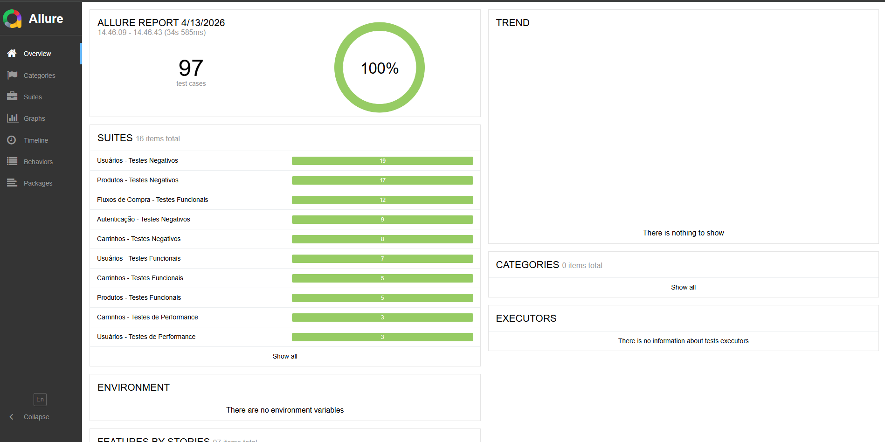

# 🧪 Serverest API — Testes Automatizados


> Projeto de automação de testes de API da plataforma [ServeRest](https://serverest.dev), desenvolvido com **Cypress** e **JavaScript**, seguindo boas práticas de QA com estrutura profissional de testes.

---

## 📖 Sobre o Projeto

Projeto de automação de testes de API REST desenvolvido para validar os endpoints da plataforma **ServeRest**, cobrindo os módulos de:

- 🔑 **Autenticação** — Login e geração de token
- 👤 **Usuários** — CRUD completo
- 🛍️ **Produtos** — CRUD completo com autenticação
- 🛒 **Carrinhos** — Criação, compra e cancelamento
- 🔄 **Fluxos** — Jornadas completas de ponta a ponta

### Cobertura de Testes

| Módulo        | Funcional | Contrato | Performance | Negativo | Fluxo |
|---------------|:---------:|:--------:|:-----------:|:--------:|:-----:|
| Autenticação  | ✅        | —        | —           | ✅       | —     |
| Usuários      | ✅        | ✅       | ✅          | ✅       | —     |
| Produtos      | ✅        | ✅       | ✅          | ✅       | —     |
| Carrinhos     | ✅        | ✅       | ✅          | ✅       | —     |
| Fluxos        | —         | —        | —           | —        | ✅    |

---

## 🛠️ Tecnologias

| Tecnologia | Versão | Uso |
|---|---|---|
| [Cypress](https://www.cypress.io/) | 15.x | Framework de testes |
| [JavaScript](https://developer.mozilla.org/pt-BR/docs/Web/JavaScript) | ES6+ | Linguagem de programação |
| [AJV](https://ajv.js.org/) | 8.x | Validação de schema JSON |
| [Allure Report](https://docs.qameta.io/allure/) | 2.x | Relatórios de testes |
| [Docker](https://www.docker.com/) | — | Ambiente isolado |
| [GitHub Actions](https://github.com/features/actions) | — | Pipeline CI/CD |

---

## ✅ Pré-requisitos

Antes de começar, certifique-se de ter instalado:

- [Node.js](https://nodejs.org/) 
- [npm](https://www.npmjs.com/) 
- [Docker](https://www.docker.com/) (para rodar o ServeRest localmente)

---

## 🚀 Como Executar

### 1. Clone o repositório

```bash
git clone https://github.com/loopfagundes/serverest-api-js.git
cd serverest-api-js
```

### 2. Instale as dependências

```bash
npm install
```

### 3. Suba o ServeRest com Docker

```bash
npm run docker:up
```

> O ServeRest estará disponível em `http://localhost:3000`

### 4. Execute os testes

```bash
# Todos os testes
npm run allTest

# Módulo específico
npm run test:usuarios
npm run test:login

# Modo visual (Cypress Open)
npm run cy:open
```

### 5. Gere o relatório Allure (local)

```bash
npm run allure:open
```

---

## 🧪 Tipos de Testes

### ✅ Testes Funcionais
Validam o comportamento esperado da API com dados válidos — criação, leitura, atualização e exclusão de recursos.

### 📋 Testes de Contrato
Validam a **estrutura do JSON** retornado pela API usando o **AJV**, garantindo que os campos e tipos estejam corretos.

```javascript
const validate = ajv.compile(usuarioSchema)
const valid = validate(response.body)
expect(valid).to.be.true
```

### ⚡ Testes de Performance
Validam o **tempo de resposta** dos endpoints, garantindo que estejam abaixo do limite aceitável.

```javascript
expect(response.duration).to.be.lessThan(2000)
```

### ❌ Testes Negativos
Validam o comportamento da API com **dados inválidos**, campos em branco, tokens expirados, permissões incorretas, entre outros.

### 🔄 Testes de Fluxo
Simulam **jornadas completas** do usuário — desde o cadastro até a finalização ou cancelamento de uma compra.

---

## 📊 Relatórios

### Allure Report (local)

```bash
npm run allure:open
```

O relatório será gerado e aberto automaticamente no navegador com:
- ✅ Histórico de execuções
- 📊 Gráficos de resultados
- ⏱️ Tempo de execução por teste
- ❌ Detalhes de falhas



---

### GitHub Actions

O projeto possui pipeline configurado com GitHub Actions

O pipeline executa automaticamente a cada `push` em qualquer branch e exibe os resultados diretamente na aba **Actions** do GitHub.

```
Push → Checkout → Setup Node.js → Install Dependencies → Run Tests
```

O ServeRest sobe automaticamente como **service container** durante o pipeline, sem necessidade de configuração manual.

---

## 🐳 Docker

```bash
# Subir o ServeRest
npm run docker:up

# Parar o ServeRest
npm run docker:down

# Ver logs
docker-compose logs -f
```

---

## 📦 Scripts disponíveis

```bash
npm run docker:up           # Sobe o ServeRest
npm run docker:down         # Para o ServeRest
npm run cy:open             # Abre o Cypress em modo visual
npm run allTest             # Roda todos os testes
npm run test:login          # Roda testes de autenticação
npm run test:usuarios       # Roda testes de usuários
npm run test:produtos       # Roda testes de produtos
npm run test:carrinhos      # Roda testes de carrinhos
npm run test:fluxos         # Roda testes de fluxos
npm run allure:clean        # Limpa os resultados e relatório Allure
npm run allure:open         # Gera e abre o relatório Allure
npm run format              # Formata o código com Prettier
```

---